# SILS (Service of Integrated Library Search)
	SILS는 통합도서관 검색을 위한 프로그램으로 제작되었으며, 
	책의 정보와 보유하고 있는 도서관목록에 대한 확인이 가능하다.

	도서관의 정보와 도서목록은 정보나루(https://www.data4library.kr/)의 
	API와 Excel자료를 기반으로 제작되었다.

	본 프로그램을 통해 정보나루 DB에 잘못 저장된 도서를 찾을 수 있으며,
	또한 오류가 있는 도서의 정보를 확인 할 수 있다.

## 기능
  ### 1. 도서 검색기능 및 상세 검색기능
  #### 메인화면
* 도서를 검색한다.

* 상세정보 검색에 체크하면 세부사항과 함께 검색할 수 있다.
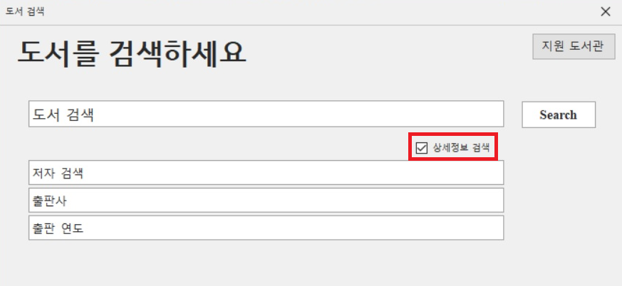

* 검색된 결과는 리스트 목록으로 출력되며 더블클릭시 책에 대한 상세정보 확인이 가능하다.
 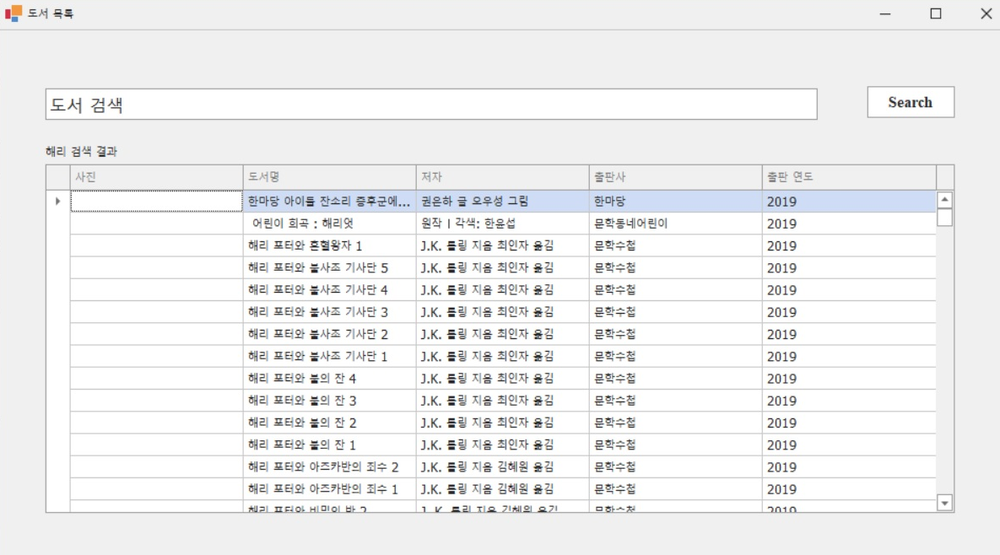

* 상세정보창
 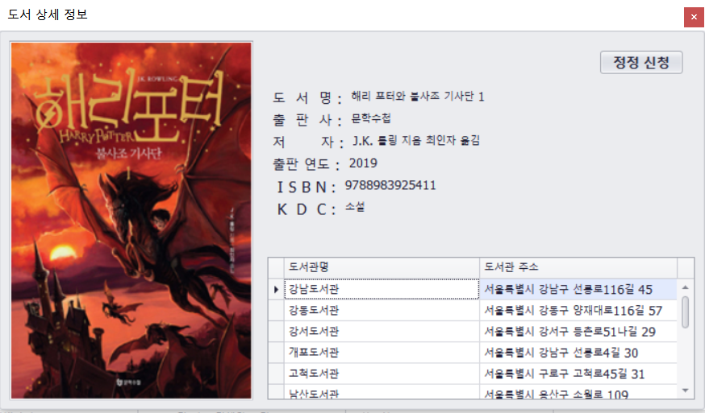 

 ### 2. 상세정보를 통한 도서 정보확인 및 보유 도서관 사이트 이동
 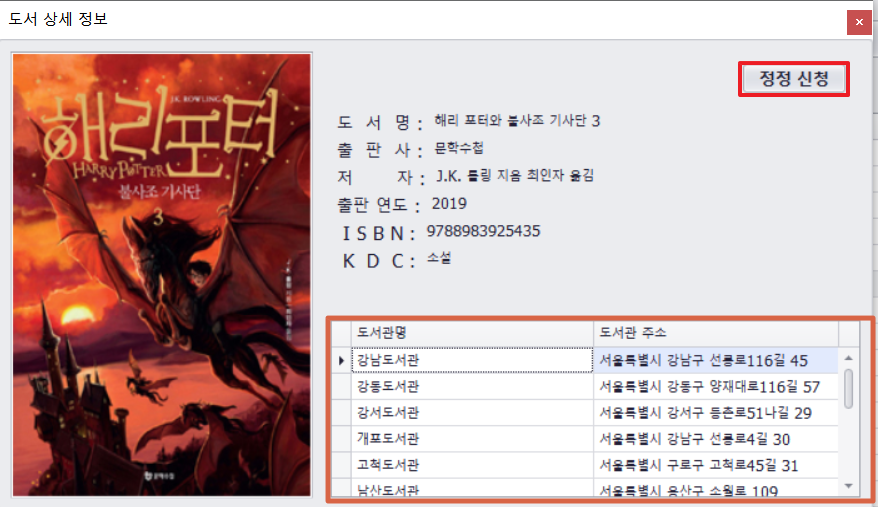
 * 도서관 상세정보 확인이 가능하다.
 * 주소를 클릭하면 해당 도서관 사이트로 이동한다.
 
 
 * 정정신청 버튼을 눌러 오류 정정신청을 할 수 있다.
 * 
 ### 3. 도서 정보에 관련된 오류들을 보고하는 화면 구현
 #### -> 오류는 도서관별, 혹은 오류 유형별로 구분 가능

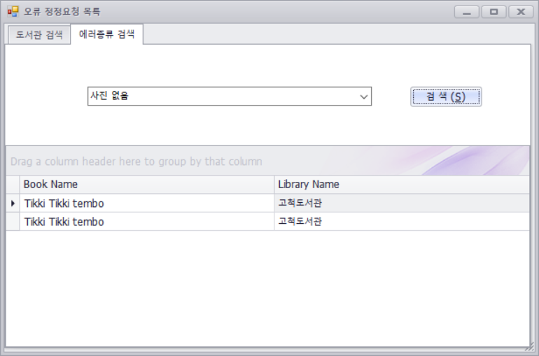
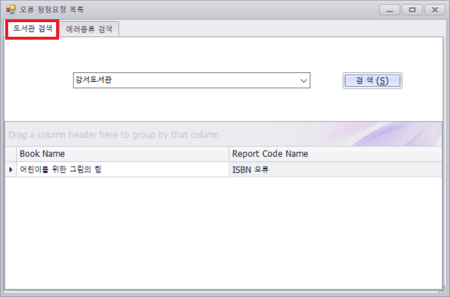

### 5. 지역별 도서관 검색 가능
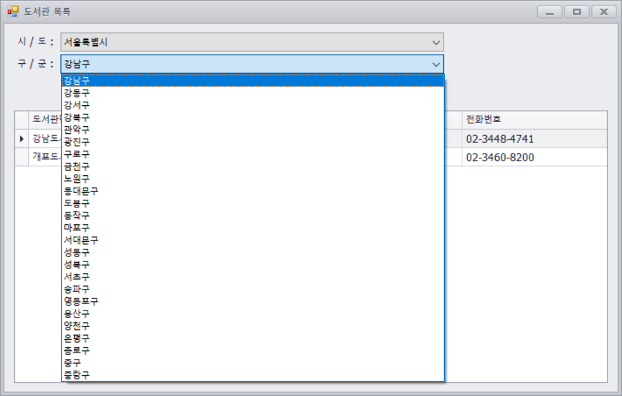

 

# 사용기술

## 언어

* C#

## FrameWork

* Entity Framework 6.0+
* .Net Framework 4.8
* Winform

## Third-Party Control

* DevExpress Winforms

## DataBase

* MS-SQL Server 2019

## API Development

* Postman

# DataBase Schema
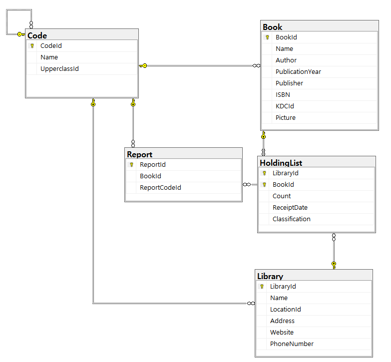

# Point of Interest

* 정보마루의 공공 API를 이용하여 도서관의 정보를 코드화 하여 DB에 입력하였다.
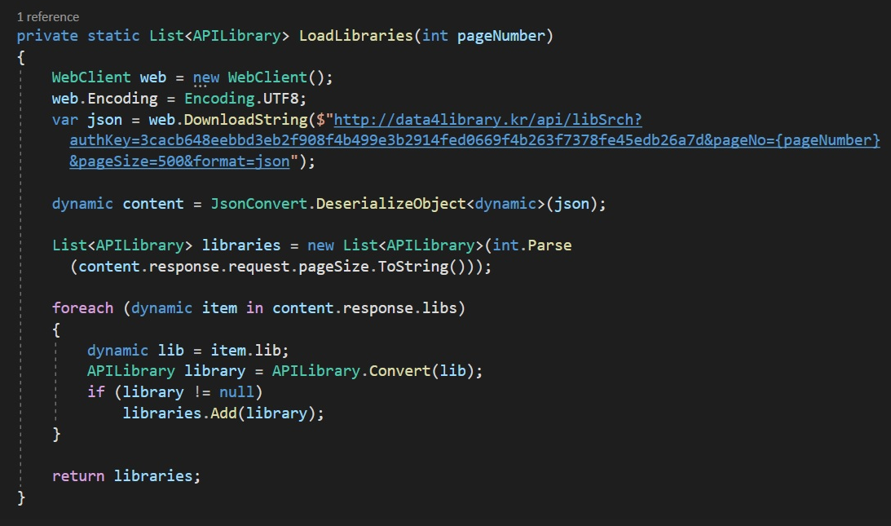

* 오류가 있는 책의 정보를 API화 하여 방출하였다. 이를 통해 중앙도서관에서 오류가 난 책들의 정보를 쉽게 확인 할 수 있도록 하였다.
* 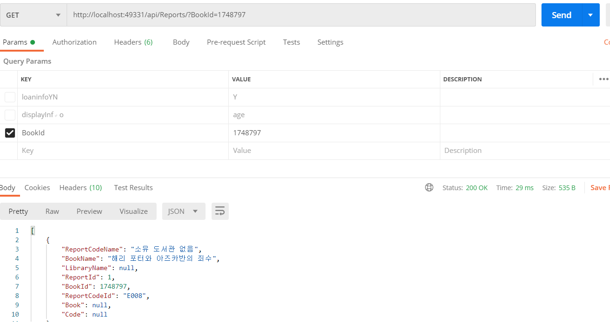

* 정보마루의 API를 이용하여 DB에 도서의 표지를 저장하지 않고 상세정보를 통해 도서를 검색할 때 표지 이미지를 불러온다.
* 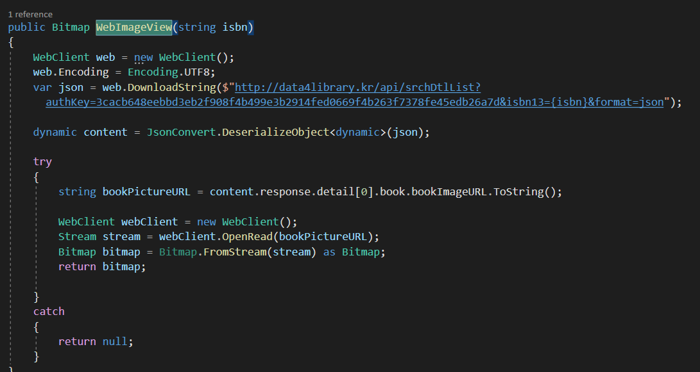

# Code Review	

* 기존 API를 통해 도서 목록을 가져 오려 했으나 두가지 결정적인 문제가 발생 하였다.
  1. 일일 500건의 API 사용제한
  2. 잦은 쿼리사용으로 인한 느린 처리 속도     
  

* CSV파일을 이용하여 대체하려 했으나 파싱과정중 텍스트에 특수기호(,?,!,...)가 포함될 경우 문제가 발생하였다.
이 문제를 해결하고자, 다음과 같은 코드를 작성 하였으나, 잦은 쿼리사용으로 인한 느린 처리 속도가 문제가 되었다. 

### 해결방안
 * 정보마루에서 제공하는 도서관별 Excel데이터를 Visual Studio에 연결한 뒤 ExcelDataReader 패키지를 이용하여 
 *데이터를 DB에 연결하게끔 코드를 작성하였다.
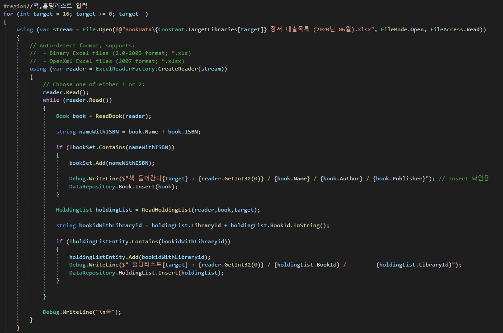

* DB에 업로드하는 속도를 줄이기 위해 HashSet을 이용하여 중복되는 정보를 걸러내었으며 그 결과 속도가 비약적으로 상승한 것을 확인했다.
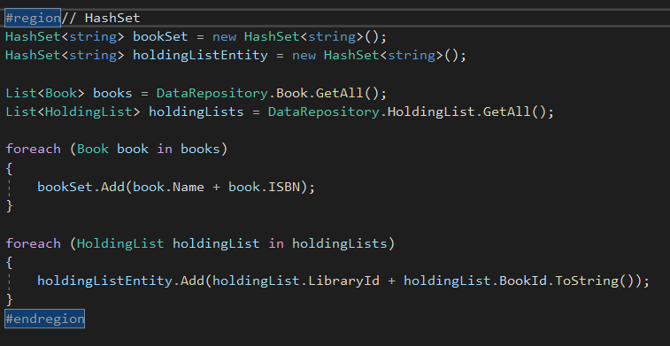

